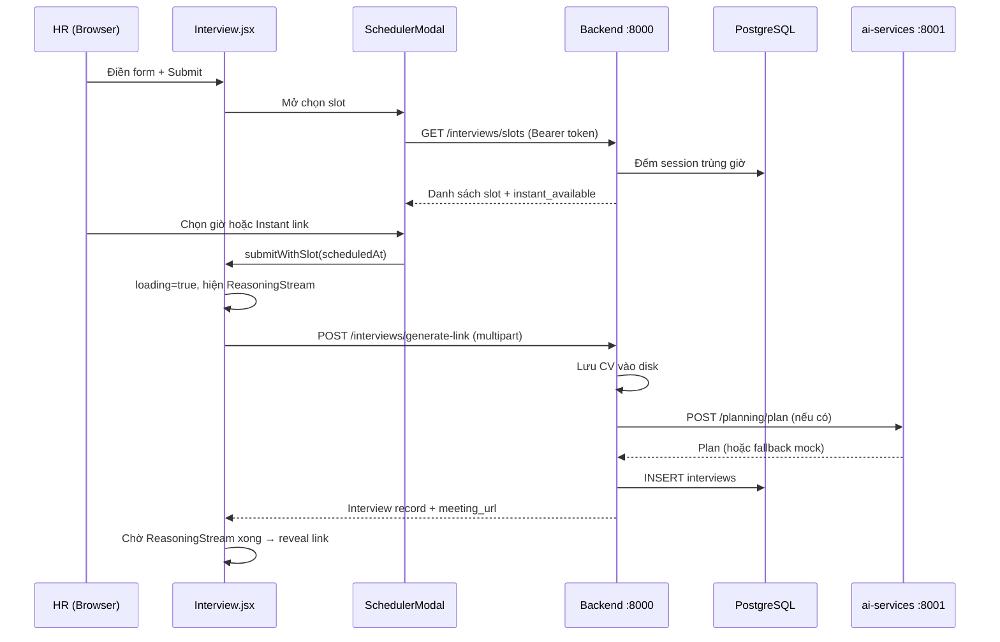

# Tab Interview — Logic & Luồng Hoạt Động

Tài liệu giải thích cách tab **Interview** trong app HR hoạt động: từ điền form, chọn giờ, gọi backend, đến hiển thị meeting link.

---

## 1. Tab này nằm ở đâu?

```
App.jsx (shell HR)
  └── tab === 'interview'  →  <Interview onCreate={handleCreate} />
```

- Route: `/` (không có path riêng), chọn tab qua query `?tab=interview` hoặc click nav **Interview**.
- Tab **Interview** và **Result** yêu cầu HR **đã đăng nhập** (`PROTECTED` trong `App.jsx`). Chưa login → redirect sang màn Login/Register.

---

## 2. Giao diện — hai cột

| Cột trái | Cột phải |
| --- | --- |
| Form điền thông tin ứng viên | Panel **Generated session** (link + trạng thái) |

### Form bắt buộc (`Interview.jsx`)

| Trường | State key | Bắt buộc |
| --- | --- | --- |
| Tên ứng viên | `candidateName` | Có |
| Email ứng viên | `email` | Có |
| Vị trí / Role | `role` | Có |
| Seniority | `seniority` | Không (mặc định `Mid`) |
| Ngôn ngữ phỏng vấn | `language` | Không (`en` / `vi`) |
| CV (PDF/DOCX/TXT) | `cvFile` | Có |
| Job description | `jd` | Có |
| Special requests | `requests` | Có |

Validation client:

```js
const valid = candidateName && email && role && jd && requests && cvFile
```

Nút **Pick a slot & generate** chỉ bật khi `valid === true`.

---

## 3. Luồng tổng thể (từ click đến có link)



---

## 4. Bước 1 — Mở modal chọn giờ

Khi HR submit form (`handleSubmit`):

1. `preventDefault()` — không reload trang.
2. Kiểm tra `valid` và không đang `loading`.
3. `setShowScheduler(true)` → render `SchedulerModal`.

**Lưu ý:** Lúc này **chưa** gọi API tạo interview. Chỉ mở lịch.

---

## 5. Bước 2 — SchedulerModal (chọn ngày & giờ)

File: `src/components/SchedulerModal.jsx`

### 5.1 Load slot từ backend

```js
fetchSlots(8, fromDate)  // → GET /api/v1/interviews/slots
```

- Cần **JWT** trong header (`authHeaders()`).
- `hours_ahead=8`: xem slot trong ~8 giờ tới (+ buffer ngày).
- `from_utc`: nếu chọn ngày khác hôm nay, gửi mốc ngày đó.

### 5.2 Lọc phía frontend

Sau khi nhận `data.slots`, modal lọc thêm:

- Chỉ giờ trong **06:30 – 23:45** (local time).
- Chỉ slot cùng **ngày** đang chọn trên mini calendar.

### 5.3 Trạng thái mỗi slot

Backend trả về mỗi slot:

```json
{
  "start": "2026-06-24T09:00:00+00:00",
  "available": true,
  "active_count": 1
}
```

| `active_count` | `available` | UI label |
| --- | --- | --- |
| 0 | true | **Open** (xanh) |
| 1–2 | true | **Available** (vàng) |
| ≥ max (3) | false | **Full** (xám, disabled) |

### 5.4 Instant link

Nếu `instant_available === true` → nút **Instant link**:

- Gọi `onConfirm('instant')`.
- Frontend convert thành `new Date().toISOString()` — phỏng vấn bắt đầu **ngay**.

Nếu hệ thống đang full session → chỉ hiện *"Full session. Please wait!"*.

### 5.5 Confirm

HR bấm **Schedule HH:MM** → `onConfirm(selected)` với ISO string của slot.

---

## 6. Bước 3 — Tạo interview (sau khi chọn slot)

`submitWithSlot(scheduledAt)` trong `Interview.jsx`:

```js
setShowScheduler(false)
setLoading(true)
const resolvedAt = scheduledAt === 'instant' ? new Date().toISOString() : scheduledAt
const record = await onCreate({ ...form, scheduledAt: resolvedAt })
```

`onCreate` ở `App.jsx`:

```js
const record = await submitInterview(form)
setInterviews((list) => [record, ...list])  // cập nhật state cho tab Result
return record
```

### 6.1 API call (`src/utils/interviews.js`)

`POST /api/v1/interviews/generate-link` — **multipart/form-data**:

| Field | Nguồn form |
| --- | --- |
| `candidate_name` | `candidateName` |
| `candidate_email` | `email` |
| `position` | `role` |
| `jd_text` | `jd` |
| `special_requirements` | `requests` |
| `interview_language` | `language` |
| `seniority` | `seniority` |
| `scheduled_at` | ISO từ modal |
| `cv_file` | file upload |

Header: `Authorization: Bearer <token>` (không set `Content-Type` — browser tự gắn boundary).

Response được `normalize()` sang camelCase cho UI (`meetingLink`, `candidateName`, …).

---

## 7. Backend xử lý gì? (`backend/app/api/v1/interviews.py`)

### 7.1 Auth

Tất cả endpoint HR (`/slots`, `/interviews`, `/generate-link`) dùng `require_hr_user` — phải có JWT role `hr` hoặc `admin`.

`GET /interviews/{id}` **public** — dành cho ứng viên vào phòng phỏng vấn.

### 7.2 Logic slot (`services/slots.py`)

Cấu hình (`configs/backend-services.yml`):

| Tham số | Mặc định | Ý nghĩa |
| --- | --- | --- |
| `max_concurrent_sessions` | 3 | Tối đa buổi phỏng vấn cùng lúc |
| `session_window_minutes` | 18 | Mỗi buổi chiếm slot 18 phút (15 phút + 3 grace) |
| `schedule_offset_minutes` | 30 | Mặc định nếu không chọn giờ |

**Đếm session active tại thời điểm T:**

- Lấy interviews có `status` ∈ `scheduled`, `in_progress`.
- Buổi đó "active tại T" nếu: `scheduled_at ≤ T < scheduled_at + 18 phút`.
- `available = active_count < max_concurrent_sessions`.

Slot sinh ra mỗi **30 phút**, từ **07:00–22:00**, trong 15 ngày tới.

### 7.3 Logic tạo link (`POST /generate-link`)

```
1. Validate form
2. Parse scheduled_at (hoặc now / now+30min nếu thiếu)
3. Tạo id: itv-{8 ký tự hex}
4. Lưu CV → data/storage/cvs/{id}/{filename}
5. Đọc text CV (.txt đọc thẳng; PDF/DOCX placeholder)
6. Gọi Planning Agent (ai-services :8001)
   └─ Lỗi / chưa có ai-services → mock plan (bài Two Sum)
7. INSERT bảng interviews (PostgreSQL)
8. Trả về meeting_url = {frontend_url}/interview/{id}
```

### 7.4 Bảng `interviews` (tóm tắt)

| Cột quan trọng | Mô tả |
| --- | --- |
| `id` | `itv-xxxxxxxx` |
| `created_by_id` | HR tạo buổi |
| `candidate_name`, `candidate_email`, `position` | Từ form |
| `jd_text`, `special_requirements` | JD + yêu cầu đặc biệt |
| `cv_path` | Đường file CV trên disk |
| `scheduled_at` | Giờ hẹn |
| `status` | `scheduled` (ban đầu) |
| `plan` | JSON kế hoạch phỏng vấn + `coding_assignment` |

---

## 8. Bước 4 — ReasoningStream (animation bên phải)

Trong lúc `loading === true`, panel phải hiện `ReasoningStream` — mô phỏng Planning Agent + Assignment Agent đang "suy nghĩ".

- **Không phải** stream thật từ AI (hiện tại).
- Là animation typewriter ~12 bước, delay 1.5s trước khi bắt đầu.
- Dùng `role`, `seniority`, `candidateName` từ form để personalize text.

### Cơ chế đồng bộ reveal link

Hai việc chạy **song song**:

1. API `generate-link` (thường nhanh hơn).
2. Animation ReasoningStream (thường chậm hơn).

Link chỉ hiện khi **cả hai xong**:

```js
// API xong trước → park vào recordRef
recordRef.current = record
if (reasoningDoneRef.current) reveal(record)

// Animation xong trước → set reasoningDoneRef
reasoningDoneRef.current = true
if (recordRef.current) reveal(recordRef.current)
```

`reveal()`:

- `setCreated(record)` — hiện link.
- `setLoading(false)` — tắt animation.
- **Không xóa form** — giữ nguyên thông tin đã điền.

---

## 9. Bước 5 — Hiển thị kết quả (panel phải)

Sau `reveal`, UI hiện:

- **Meeting link** — `{origin}/interview/{id}` (copy được).
- **Trạng thái slot:**
  - `linkIsLive` — trong cửa sổ ±18 phút quanh `scheduledAt` → *"Link is live"*.
  - Ngược lại → *"Link opens at …"*.
- **Role · Seniority** từ record.

Ứng viên mở link → route `/interview/:id` → `InterviewRoom.jsx` (màn hình khác, không thuộc tab HR).

---

## 10. Liên kết với tab Result

Khi tạo thành công, `App.jsx` thêm record vào `interviews` state:

```js
setInterviews((list) => [record, ...list])
```

Tab **Result** đọc cùng state này (và poll refresh khi mở tab). Khi reload trang, `loadInterviews()` gọi `GET /api/v1/interviews` để lấy lại từ DB.

---

## 11. Sơ đồ file liên quan

```text
frontend/
  src/
    App.jsx                    # Tab shell, auth, handleCreate
    pages/Interview.jsx        # Form + reveal logic
    components/
      SchedulerModal.jsx       # Calendar + slot picker
      ReasoningStream.jsx      # Animation "AI planning"
    utils/interviews.js        # fetchSlots, submitInterview, normalize
    constants/interview.js     # EMPTY form state
    constants/mock.js          # USE_MOCK_API flag

backend/
  app/api/v1/interviews.py     # REST endpoints
  app/services/
    slots.py                   # Tính slot trống
    planning.py                # Gọi AI / mock plan
    storage.py                 # Lưu CV
  app/models/interview.py      # SQLAlchemy model
```

---

## 12. Mock vs Backend thật

| `USE_MOCK_API` | Hành vi |
| --- | --- |
| `true` | Slot + tạo interview lưu trong RAM browser (`mocks/store.js`) |
| `false` | Gọi backend thật, lưu PostgreSQL |

Hiện tại project đặt `USE_MOCK_API = false` — tab Interview dùng backend.

Planning Agent: backend **luôn cố** gọi `http://localhost:8001/api/v1/planning/plan`. Nếu ai-services chưa chạy → **mock plan** (bài coding Two Sum) vẫn tạo link bình thường.

---

## 13. Lỗi thường gặp

| Triệu chứng | Nguyên nhân | Cách xử lý |
| --- | --- | --- |
| `Failed to load available slots` | Backend cũ (404) hoặc chưa rebuild Docker | `docker compose up -d --build` |
| `Please sign in to view available slots` | Token hết hạn / chưa login | Đăng nhập lại HR |
| Form submit không làm gì | Thiếu trường bắt buộc hoặc chưa upload CV | Kiểm tra `valid` |
| Link không hiện sau rất lâu | API lỗi nhưng animation vẫn chạy | Xem Network tab / backend logs |

---

## 14. Việc làm tiếp theo (ngoài scope tab này)

- **ai-services Planning Agent** — thay mock plan bằng plan thật từ CV+JD.
- **Assignment Agent** — sinh bài coding/cognitive khi tạo link.
- **LiveKit join-token** — ứng viên vào phòng voice thật (`useLiveKit.js`).
- **Inspector** — chấm điểm + report PDF khi kết thúc buổi phỏng vấn.